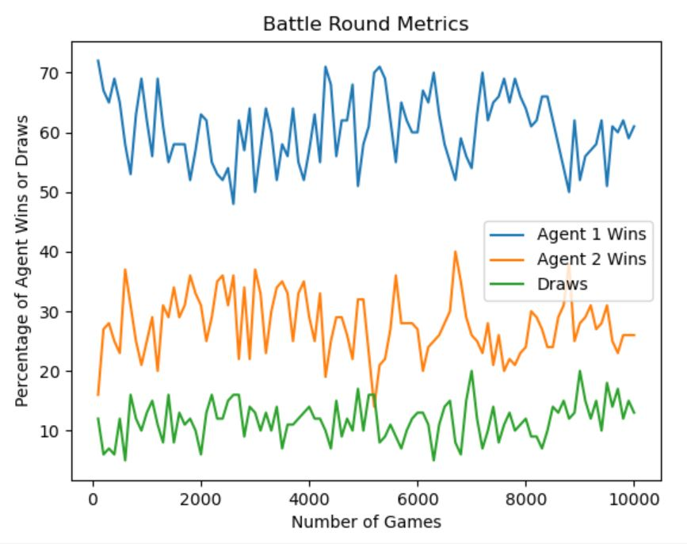
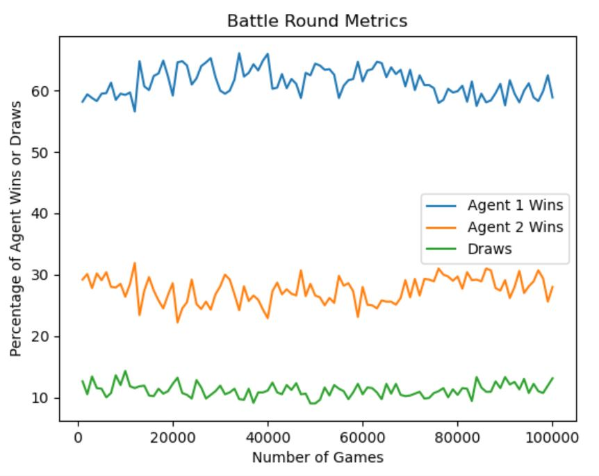

# MLProject

## Reinforce That Tic-Tac-Toe
Machine Learning project Fall 2020

This project allows us to try something new and venture in-depth on a topic that was not covered in an assignment.

# Contributors
Gabriel Morales, Chelsea Flores Young, and Waewarin Chindarassami

# Specifications and Dependencies
The IDE that we used to complete this project is PyCharm Community Edition.

In addition, the packages that need to be installed in the IDE to run the program are:
* `Pygame`
* `numpy`
* `matplotlib`

# Scope
This program is an integration of Machine Learning with UI and an adversarial game. 

Once the program starts up, the user will be given three options:
* Train Agent
* Player vs. Agent
* Player vs. Player

## Train Agent
Once the button is clicked, the program will begin training for use in Player vs. Agent.

For reinforcement learning, the program uses the Tabular Q Learning Algorithm to train the agent. 

After the training is completed, a graph of the training performance will automatically be displayed.

#### Tabular Q Learning Algorithm
The algorithm uses the Q function (*Quality* function). 

When the agent needs to make a move, it will search for the state of the board in the lookup table. If the state has already been done before, the agent will look at the q values for that state and choose the space on the board with the highest value for its move. If the state has not been explore yet, then the agent will randomly pick a space and add the new state into the lookup table.

Once it picks a valid move, it will add a key-value pair of board state-move to the play history.

Once the game is over, the program gets the final results (or the final q values) of the game. It works backwards through the play history and assigns the appropriate q value for each space on the board. The final move will get the reward or penalty assigned for a win, lose, or tie. Then, working backwards, it assigns the spaces with decreasing q value each time, because the further back we go the less important the move is in contributing to the end result. With the final q values calculated, it is compared with the q values associated with the corresponding state, and the greater q values will then be saved for that state.

## Player vs. Agent
A human player will be able to play against a trained agent.

## Player vs. Player
A normal human vs. human game of tic-tac-toe.

It is a simple 3 x 3 array with a player turn "queue", which is also used as a basis for Player vs. Agent.

# Performance
## Tabular Q vs. Tabular Q (Left) and Tabular Q vs. Random Player (Right)
#### 100 Battles with 100 Games per Battle -> 10,000 Games Total
</img>
</img>

#### 100 Battles with 1,000 Games per Battle -> 100,000 Games Total
</img>
</img>

# Credits
The basis for both the Tabular Q Learning Algorithm and the implementation of the project are from the following:

Tutorial: https://medium.com/@carsten.friedrich/part-3-tabular-q-learning-a-tic-tac-toe-player-that-gets-better-and-better-fa4da4b0892a

Example code: https://github.com/fcarsten/tic-tac-toe/blob/master/tic_tac_toe/TabularQPlayer.py

The song that is playing while the program is running is:

On Hold For You by Kevin MacLeod

Link: https://incompetech.filmmusic.io/song/6928-on-hold-for-you

License: http://creativecommons.org/licenses/by/4.0/
